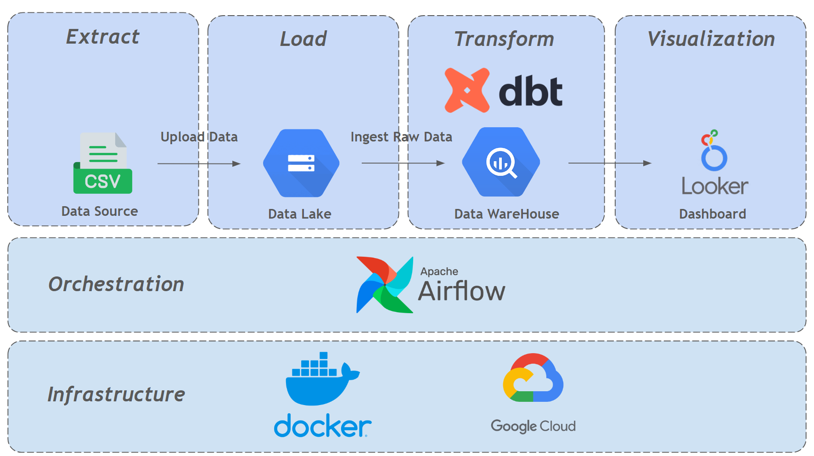
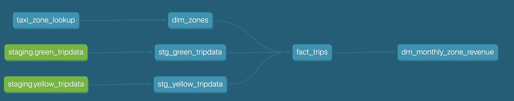
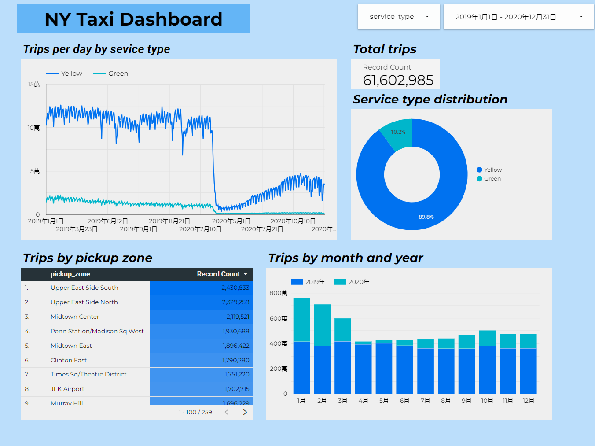

# NY Taxi Data Engineering Project
## Project Overview
## Data Architecture

### Data Source
NY taxi
### Docker
mount dbt and gcp credential files into docker
- .dbt/profile.yml (fill in your dataset, credential, project name)
- dbt (model, macros, seeds etc.)
- gcp credential

Docker file will install packages in requirements.txt
```
pandas
pyarrow
google-cloud-storage
dbt-bigquery
apache-airflow
apache-airflow-providers-google
```
### Airflow
manage 3 tasks:
- extract_and_load
    - Using: PythonOperator
    - Doing: download csv files and upload to GCS (data lake)
- create_external_table
    - Using: BigQueryInsertJobOperator
    - Doing: ingest raw data into BigQuery by creating external table (data warehouse)
- run_dbt_task
    - Using: BashOperator
    - Doing: build DBT model
### Transform (DBT & BigQuery)

- using DBT
- model, seed, macro
### Visualizaton (Looker Studio)

quick finding:
- 90% of NY taxi trips in 2019 ~ 2020 were run by yellow taxi
- upper east side south/north and midtown center are top pickup zones
- The covid 19 pandemic has huge impact on NY taxi trips
## Improvement
- try data ingestion tool like airbyte or fivetran to replace python in EL part
- divide airflow task into more steps to make it easier for debugging
- use production profile to deploy dbt model
## Credit